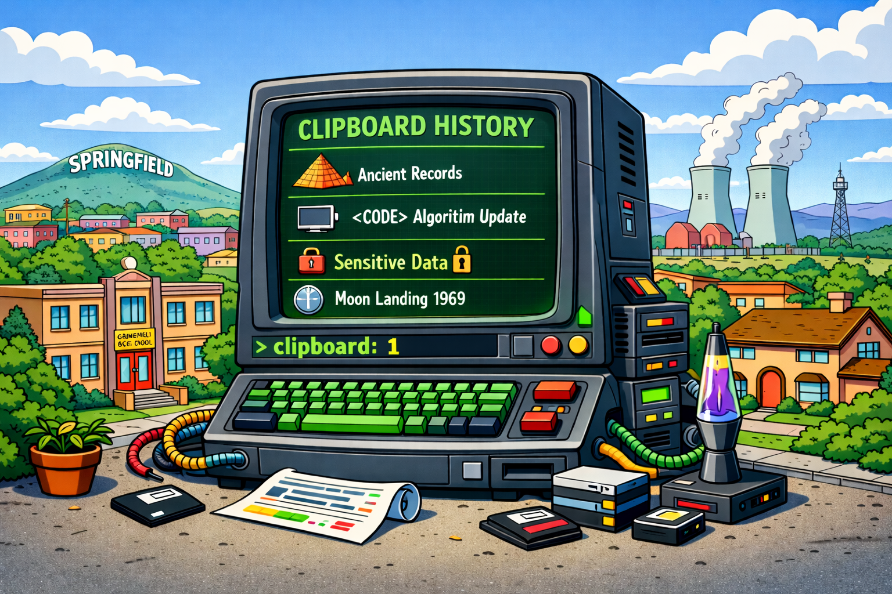

# saveclip

<p align="center">
  
</p>

Clipboard history manager for macOS.

> **Note** — This is a personal tool. You are welcome to explore the code or
> fork it, but please set your expectations accordingly.

## What it does

A background daemon polls `NSPasteboard` and saves every copy (text, images,
file paths) to SQLite + on-disk bundles with all UTI representations preserved.
The binary doubles as a CLI — `saveclip` alone prints the latest clip (like
`pbpaste`), piped input is saved (like `pbcopy`), and file arguments are added
to history. A built-in TUI picker lets you search, filter, and restore entries
instantly.

## Features

- **Full fidelity** — stores every pasteboard representation (rich text, HTML, images, source URLs), not just plain text
- **Built-in TUI** — fullscreen terminal picker with FTS5 search (+ typo fallback), syntax-highlighted preview (via `bat`), image preview (half-block 24-bit color), mouse support, and inline actions
- **Pipe mode** — `clip` works like `pbcopy`/`pbpaste`: `echo foo | clip` saves, `clip` outputs, `... | clip | ...` tees through
- **File import** — `clip add photo.png` saves files with path info + native content (like a Finder copy)
- **Auto-refresh** — TUI updates live as new clipboard entries arrive
- **Mouse support** — click to select, double-click to copy, scroll wheel, draggable preview/list divider
- **Adaptive colors** — detects terminal fg/bg colors via OSC 10/11, age-based grey gradient that works in dark and light modes, reacts to theme changes live
- **Security** — skips concealed/transient pasteboard items (1Password, security codes); auto-flags AWS keys, GitHub PATs, SSH keys, JWTs, etc.
- **Deduplication** — identical content is merged, most recent timestamp wins
- **Branches** — organize clips by context (auto-route by app, manual switch)
- **Frequency tracking** — surfaces repeatedly copied entries
- **Pin / TTL** — pin important clips; old unpinned ones expire automatically
- **Compression** — gzip-compresses old entries to save disk space
- **Budget eviction** — stays under a configurable storage cap, evicting large old media first

## Requirements

- macOS 13+
- Swift 5.9+

## Install

```sh
sudo make install   # builds, installs to both paths, re-signs, restarts daemon
make link           # symlinks zsh integration to ~/.zsh/ (one-time setup)
```

Then source from your `.zshrc`:

```sh
source ~/.zsh/saveclip.zsh
```

The `saveclip` binary works directly or through the `clip` zsh wrapper:

- `saveclip` / `clip` — print latest clip to stdout (falls back to live pasteboard)
- `echo foo | saveclip` / `echo foo | clip` — save stdin, tee to stdout
- `saveclip file.png` / `clip add file.png` — add file to history
- `saveclip 42` / `clip 42` — copy entry #42 back to clipboard
- `saveclip --help` — quick usage + all subcommands
- `clip help` — detailed wrapper help

The wrapper adds a few shortcuts: `clip -5` for last 5, `clip --pop`, `clb` for the TUI.

## TUI picker

```
 ALL 42/200                enter=copy  ^O=out  ^D=del  ^P=pin  ^T=top  ^F=freq  ^B=branch
  {                                              ┐
    "name": "saveclip",                          │ syntax-highlighted
    "version": "1.0"                             │ preview (bat)
  }                                              ┘
──────────────────────────────────────────────────
  38   5m  just a regular note
  37  28m  [sensitive] AKIAIOSF**************
  36  28m  [pin] normal safe text
> 35  30m  {"name": "saveclip", "version": "1.0"}
  34  31m  [work] Slack message content here
  33  35m  SELECT * FROM users WHERE id = 42
 > _
```

Fullscreen TUI (alternate screen). Type to search — FTS5 prefix matching with
Levenshtein fallback for typos, debounced 200ms. Arrows, mouse, or Cmd+Up/Down
to navigate. Enter or double-click to copy back to clipboard. Selected text
(<1KB) is emitted to stdout for `print -z` shell integration. The preview/list
divider is draggable and its size persists across sessions.

If `bat` is installed, text preview is syntax-highlighted (ansi theme, language
auto-detected). Images render inline as half-block characters with 24-bit
color. URLs are highlighted in the preview.

## Usage

```sh
# Daemon
clip start              # start the clipboard daemon
clip stop               # stop it
clip status             # check if running
clip config             # show current configuration

# Interactive TUI picker
clb                     # browse & pick from history
clb <query>             # open with pre-filtered search
clip search <query>     # alias for clb <query>

# Pipe mode (like pbcopy/pbpaste)
clip                    # print last clip to stdout
clip --pop              # print last clip and remove it
clip -5                 # last 5 entries (double-newline separated)
clip -5 -0              # last 5 entries (null-separated)
echo foo | clip         # save stdin, pass through to stdout
echo foo | clip -q      # save quietly (no tee, no status output)
cat file | clip         # save entire file as one entry
... | clip | jq         # tee: saves and passes through
... | clip -s           # slurp all stdin as one entry
printf 'a\0b\0c' | clip  # null-delimited → 3 separate entries

# Add files (images, PDFs, any file)
clip add photo.png          # saves with file URL + image data
clip add a.png b.txt c.pdf  # multiple files, each a separate entry
clip add *.png              # glob works naturally

# List / get entries
clip list               # list entries (current branch)
clip list --all         # list entries (all branches)
clip <id>               # copy entry back to clipboard
clip get <id> -o        # print to stdout instead
clip get <id> -p        # print file path of stored clip
clip frequent           # show most frequently copied entries

# Manage entries
clip pin <id>           # pin (survives TTL expiry)
clip unpin <id>
clip delete <id>
clip clear              # delete all entries
clip scrub              # find & flag sensitive entries (keys, tokens)

# Branches
clip branch             # show current
clip branch work        # switch
clip branch -           # switch back to main
clip branches           # list all branches with counts
clip move <id> <branch>
clip help               # wrapper help (safer than clip --help in non-tty shells)
```

### TUI keybindings

| Key | Action |
|-----|--------|
| Enter | Copy to clipboard |
| Ctrl-O | Print to stdout |
| Ctrl-D | Delete selected |
| Ctrl-P | Toggle pin |
| Ctrl-T | Bump to front (most recent) |
| Ctrl-F | Toggle frequent view |
| Ctrl-B | Toggle branch filter |
| Ctrl-R | Reload from DB |
| Up/Down / Scroll | Navigate |
| Cmd+Up / Cmd+Down | Jump to top / bottom |
| PgUp/PgDn | Page scroll |
| Click / Double-click | Select / Copy |
| Drag divider | Resize preview panel |
| Typing | FTS5 search (debounced, typo fallback) |
| Esc / Ctrl-C | Exit |

### Mouse support

- **Scroll wheel** in the list area moves the selection cursor
- **Scroll wheel** in the preview area scrolls preview content
- **Click** selects an item, **double-click** copies it
- **Drag the divider** between preview and list to resize (persisted to `~/.saveclip/tui-state`)

## Configuration

`~/.saveclip/config.toml`:

```toml
poll_interval = 0.5
max_entries = 1000
max_entry_size = 10485760
max_storage_mb = 300
compress_after_days = 7
ttl_days = 90
excluded_apps = ["1Password", "Keychain Access"]
sensitive_patterns = ["my-custom-pattern"]

# Concealed/transient pasteboard types are always skipped
# (1Password, macOS security codes, autofill)

# Auto-route apps to branches
branch.Slack = "work"
branch.Discord = "social"
```

## License

MIT
